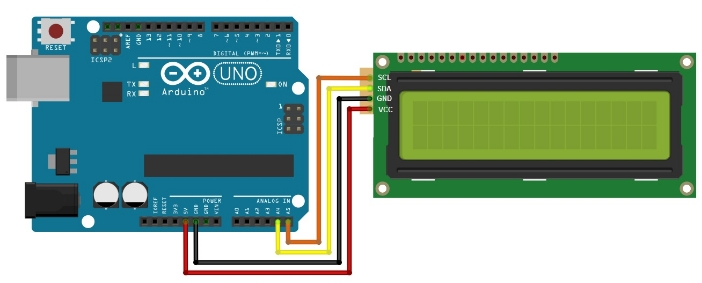

**Temperature and Humidity Measurement**

Table of content

- Project description
- Components and supplies
- Circuit Diagram
- Code
- Resources

**Project description**

**The Temperature and Humidity Measurement Project is designed to monitor environmental conditions using an Arduino microcontroller and compatible temperature and humidity sensors.**

**Components and supplies**

**Hardware:**

1. **Arduino uno R3**
1. **Breadboard**
1. **DHT11–Temperature and Humidity Sensor**
1. **Jumber wires**
1. **LCD 2 \* 16 with I2C**

**Software:**

1. **Arduino IDE**
1. **DHT library**
1. **LiquidCrystal\_I2C library**

**Circuit Diagram**

**Connect Lcd to Arduino**

**Connect DHT sensor To Arduino**

**Project Code**

**Resources**

1. [**Project Code**](https://ideone.com/RigH28)
1. [**Project Simulation**](https://wokwi.com/projects/389027163280610305)
1. [**Sensor manual](https://www.tme.eu/Document/7a4fd48d400b8c4c8309ef1e2b13cdd4/MR003-005-1.pdf)**

Thanks

